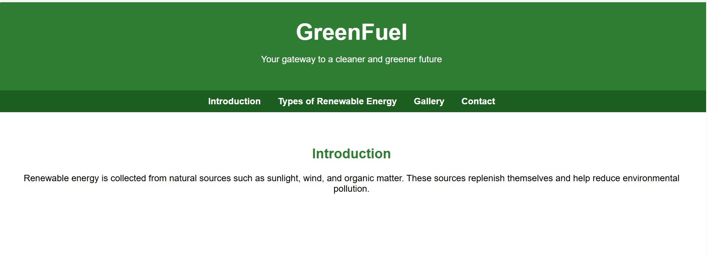
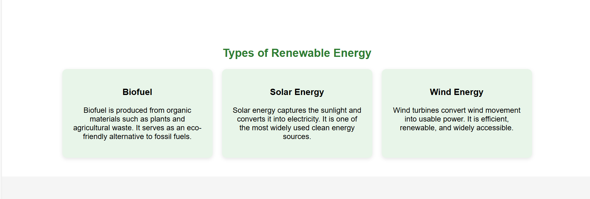
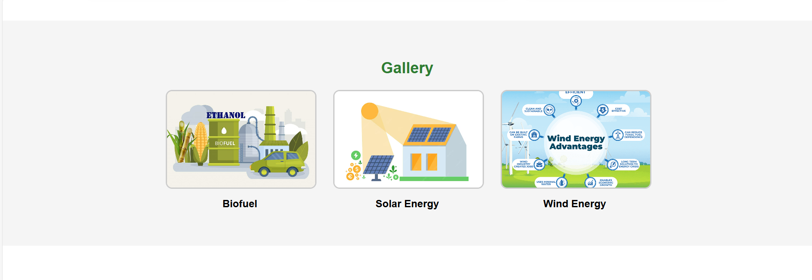
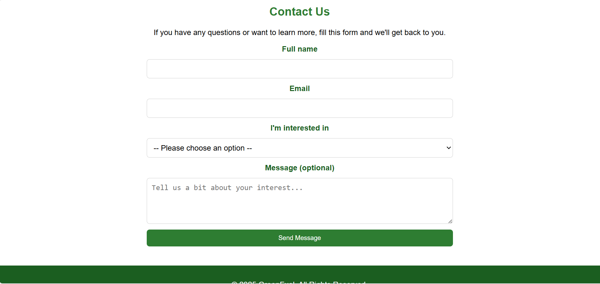
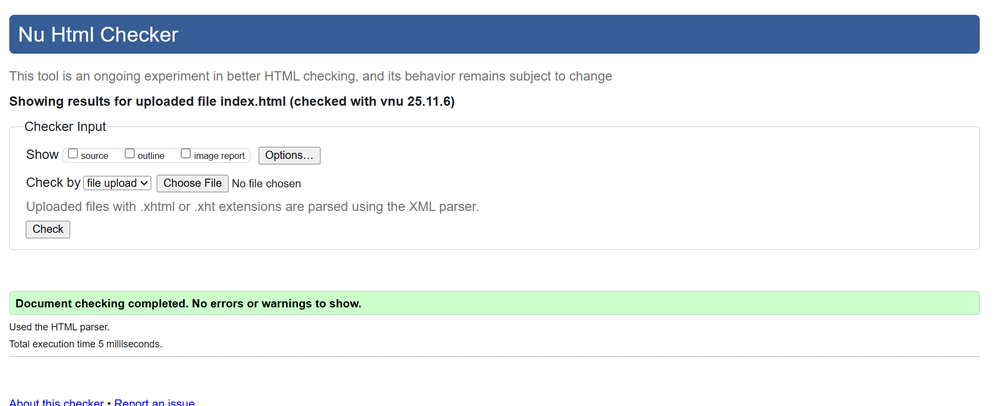

# GreenFuel – Renewable Energy Solutions

## 1. Project Idea / Seed
GreenFuel is a static website designed to showcase renewable energy solutions, including biofuel, solar, and wind energy.  
The project’s goal is to educate users about sustainable energy sources and provide a gateway for contact, collaboration, or pre-orders.

---

## 2. Design Rationale
- **HTML/CSS/JS**: Simple, lightweight, and fully static for easy deployment on GitHub Pages.  
- **Responsive design**: The website adapts to different screen sizes, including mobile devices.  
- **Navigation**: Sections (Introduction, Types, Gallery, Contact) make the website easy to browse.  
- **Visual appeal**: Use of images and cards to clearly convey types of renewable energy.  
- **Accessibility**: Semantic HTML (`<header>`, `<nav>`, `<section>`, `<footer>`) improves accessibility and SEO.

---

## 3. Screenshots
### Homepage

### Types of Renewable Energy Section

### Gallery Section

### Contact Section

---

## 4. Validator Proofs
### HTML Validator

### CSS Validator

---

## 5. Deployment
- Hosted on **GitHub Pages**: [https://l250721-art.github.io/l250721-art/](https://l250721-art.github.io/l250721-art/)  
- Static HTML site, `.nojekyll` file added to bypass Jekyll processing.

---

## 6. Contact / Further Info
For any questions or suggestions, you can use the **Contact section** on the website to get in touch.
